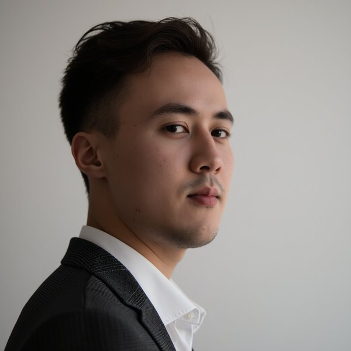

# AI Professional Headshot Studio

**Stop paying $50+ for AI headshots. Train your own model once and generate unlimited portraits for pennies.**

This toolkit uses **Flux + LoRA** — the best open-source approach for photorealistic face generation in 2025/2026 — to produce corporate headshots indistinguishable from a professional studio shoot.

---

## Example results

Both images below were generated with this repo (Flux LoRA, `corporate` preset, no manual editing):

<table>
  <tr>
    <td></td>
    <td></td>
  </tr>
  <tr>
    <td align="center"><em>corporate — three-quarter</em></td>
    <td align="center"><em>corporate — front-facing</em></td>
  </tr>
</table>

---

## Why this beats paid services

| | Aragon AI / HeadshotPro | This repo |
| --- | --- | --- |
| Cost | $29–$99 one-time | ~$2–5 total |
| Per image | Included (limited) | ~$0.01–0.05 |
| Quality | Good | **Same or better** |
| Control | None | Full |
| Reuse | One-time | Forever |
| Fun portraits | No | Yes |

---

## How it works

1. **Train a LoRA** on 10–20 photos of your face using [Replicate](https://replicate.com) (~$2, ~15 min)
2. **Run `generate.py`** to call your model via the Replicate API
3. **Get headshots** saved locally as PNG, ready to use

---

## Quickstart

### 1. Prerequisites

- Python 3.10+
- A [Replicate](https://replicate.com) account (free to sign up, pay-per-use)

### 2. Install dependencies

```bash
pip install -r requirements.txt
```

### 3. Set up your environment

```bash
cp .env.example .env
```

Edit `.env` with your values:

```text
REPLICATE_API_TOKEN=r8_your_token_here
MODEL_NAME=your-username/your-lora-model:version_hash
```

Get your API token at replicate.com/account/api-tokens.
`MODEL_NAME` comes from your trained LoRA — see [Training Guide](docs/1-training.md).

### 4. Configure and run

Open `generate.py` and set these three variables at the top:

```python
TRIGGER_WORD = "JOHN"       # Your LoRA trigger word (used during training)
MODE         = "headshot"   # "headshot" or "fun"
PROMPT_KEY   = None         # None = use default, or pick one from prompts.py
```

Then run:

```bash
python generate.py
```

Images are saved in `outputs/` with a `session.log` tracking the seed and prompt used.

---

## Prompts

### Headshot prompts (`MODE = "headshot"`)

| Key | Description |
| --- | --- |
| `corporate` _(default)_ | Classic dark suit, three-quarter view, athletic |
| `corporate_serious` | Executive, neutral expression, no smile |
| `corporate_young` | Same suit, younger energy (25 yo) |
| `casual` | Golden-hour, relaxed, social profile |

### Fun prompts (`MODE = "fun"`)

| Key | Description |
| --- | --- |
| `npc` _(default)_ | Blank deadpan NPC face |
| `rizz` | Maximum rizz smirk |
| `main_character` | Cinematic main-character moment |
| `side_eye` | Judgmental side-eye |
| `medieval_knight` | Full armor fantasy portrait |
| `superhero` | Caped hero above the city |
| `astronaut` | Floating in space with aliens |
| + more | See `prompts.py` |

---

## Inference presets

Set `PRESET` in `generate.py` to control the quality/identity tradeoff:

| Preset | Best for |
| --- | --- |
| `balanced` _(default)_ | Best overall quality + identity |
| `identity` | Most recognizable face (less generic) |
| `consistent` | Stable framing and head size across runs |
| `2025` | Previous go-to settings |

See [docs/3-inference.md](docs/3-inference.md) for a deep dive on each parameter.

---

## Training your LoRA

Full guide: [docs/1-training.md](docs/1-training.md)

**TL;DR:**

1. Collect 10–20 high-quality 1024×1024 photos of your face
2. Go to replicate.com/replicate/fast-flux-trainer/train
3. Upload your photos, set a trigger word, train for 2000 steps
4. Copy the model version ID into your `.env`

Cost: ~$2 for 2000 steps on Replicate.

---

## Project structure

```text
flux-lora-headshots/
├── generate.py          # Main script — run this
├── prompts.py           # All prompt templates
├── requirements.txt
├── .env.example         # Copy to .env
└── docs/
    ├── 1-training.md    # How to train your LoRA
    ├── 2-prompting.md   # Prompt strategy and tips
    └── 3-inference.md   # Parameter tuning reference
```

---

## Privacy

- Your `.env` (API token, model name) is gitignored and never committed
- Generated images are gitignored — nothing personal is ever pushed
- Your LoRA stays private on your Replicate account unless you publish it

---

## Cost estimate

| Step | Service | Cost |
| --- | --- | --- |
| LoRA training (2000 steps) | Replicate | ~$2 |
| Generate 4 images (PNG, 50 steps) | Replicate | ~$0.10–0.20 |
| Generate 100 headshots | Replicate | ~$2.50–5 |

Replicate charges per second of GPU time. Exact pricing at replicate.com/pricing.

---

## Refining results with FaceFusion

AI-generated faces occasionally have subtle flaws — a slightly off eye, soft skin texture, or an unnatural expression. [FaceFusion](https://github.com/facefusion/facefusion) is the best open-source tool to fix these before you use the image.

**What it does:** face restoration (GFPGAN / CodeFormer), face enhancement, and optionally face-swapping onto a better base photo.

**Typical workflow:**

1. Generate a batch of headshots with this repo
2. Pick the best one
3. Run it through FaceFusion's **face enhancer** (CodeFormer mode) to sharpen details and fix any artifacts
4. Do a final touch-up in Photoshop / GIMP if needed (blemishes, background, lighting)

FaceFusion runs locally with a GPU or on Google Colab for free. See their repo for install instructions.

---

## Alternatives

If you don't want to use Replicate:

- **fal.ai** — similar API, slightly different pricing
- **FluxGym** (github.com/cocktailpeanut/fluxgym) — fully local training (needs 12–20GB VRAM)
- **ComfyUI + Flux** — local inference, no GPU costs

---

## License

MIT — use freely, attribution appreciated.
